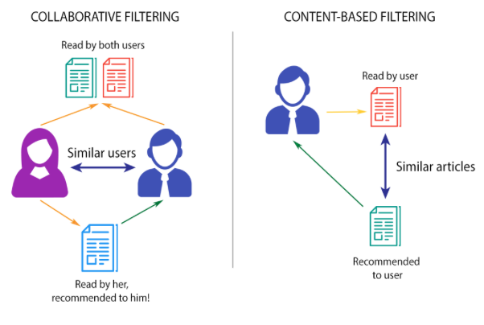

# Audio Recommendation Algorithm 

Within this project, we will take a look at a real dataset of songs from 1950 to 2011. 

## Modules/Libraries
- Python 
- Numpy
- MatplotLib
- Scikit-Learn
- Pandas 

## Dataset Overview

This dataset contains a mix of lyrical and continuous variables pulled from a 2020 research paper titled Music Dataset: Lyrics and Metadata from 1950 to 2019. Review the list below to find out more about this datasets columns:

### Categoircal/Lyrical Variables 

- artist_name: The name of the artist
- track_name: The name of the song
- release_date: When this song was released
- genre: The categorical genre of this song
- lyrics: The pre-tokenized lyrics of this song. Disclaimer: note that as this is real-world data, lyrical content is often obscene. 
- topic: The categorical label of lyrical content

### Continuous Variables 

- len:  The number of words in the lyrics of this song
- dating: A score from 0 to 1 expressing how likely it is that this song’s lyrics have something to do with dating.
- violence: A score from 0 to 1 expressing how likely it is that this song’s lyrics have something to do with violence.
- world/life: A score from 0 to 1 expressing how likely it is that this song’s lyrics have something to do with the world or life in general terms.
- night/time: A score from 0 to 1 expressing how likely it is that this song’s lyrics have something to do night-life or time.
- shake the audience: A score from 0 to 1 expressing how likely it is that this song’s lyrics have something to do with provocative feeling.
- family/gospel: A score from 0 to 1 expressing how likely it is that this song’s lyrics have something to do with family-oriented content or the gospel.
- romantic: A score from 0 to 1 expressing how likely it is that this song’s lyrics have something to do with romantic feeling.
- communication: A score from 0 to 1 expressing how likely it is that this song’s lyrics have something to do with communication (either in romantic terms or otherwise).
- obscene: A score from 0 to 1 expressing how likely it is that this song’s lyrics have something to do with obscene content (money, rockstar-lifestyle, etc).
- music: A score from 0 to 1 expressing how likely it is that this song’s lyrics have something to do with music (music about music, basically).
- movement/places: A score from 0 to 1 expressing how likely it is that this song’s lyrics have something to do with movement or various locations.
- light/visual perceptions: A score from 0 to 1 expressing how likely it is that this song’s lyrics have something to do with the sun or other physical weather-related patterns.
- family/spiritual: A score from 0 to 1 expressing how likely it is that this song’s lyrics have something to do with the importance of family or spirituality.
- sadness: A score from 0 to 1 expressing how likely it is that this song’s lyrics have something to do with the importance of family or spirituality.
- feelings: A score from 0 to 1 expressing how likely it is that this song’s lyrics have something to do with emotions, either positive or negative.
- age: A score from 0 to 1 expressing how “old” a song is from our perspective. 1 being the oldest, and 0 being the newest.

# Exploratory Data Analysis 

## Univariate Analysis 

Exploring individual variables to understand their distribution and significance using barplots, lineplots and histograms
- Top 10 most frequent artists 
- Most Popular Genres
- Genre vs features 
- Age vs genre
- Count of each topic 

* Key insighs: Johnny Cash and Ella Fitzgerald dominate the dataset. 
While genres like Pop and Country are most represented - Hip Hip is much less(Hip Hop began in the 70's)
* Take a look a

## Bivariate Analysis 
Exploring relationships between two variables using scatterplots and boxplots 
- length of lyrics over a period of time w/ genre
- Age vs topic 
- Genre count w/ topic 
- Songs released w/ topic 
- Age vs features
- Genre vs features

